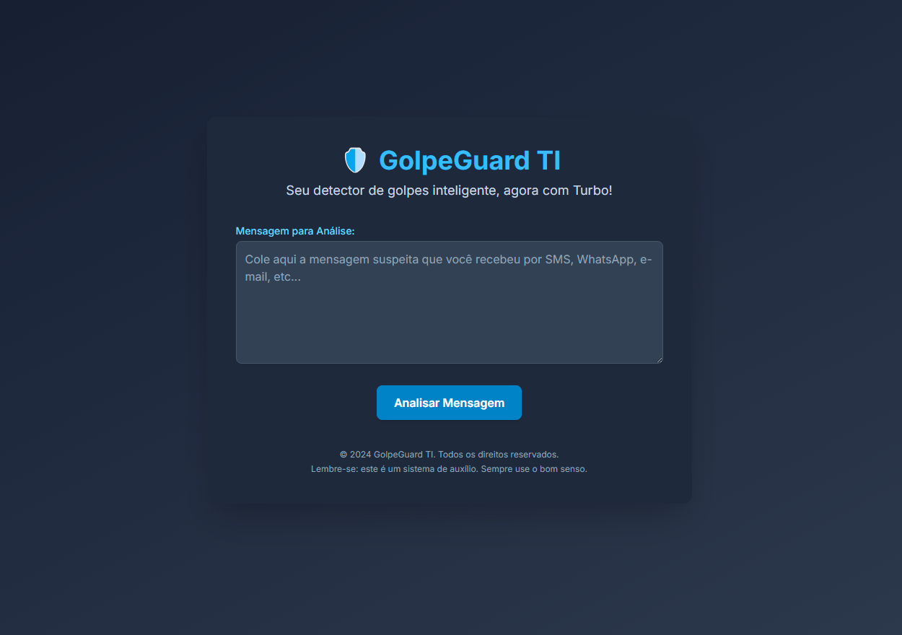

# GolpeGuard-App
Aplicação Flask inteligente para detecção de golpes, combinando aprendizado de máquina local com modelos avançados como GPT-4 Turbo e Gemini Pro.

# GolpeGuard: Detetor Inteligente de Golpes com Flask, IA e Aprendizagem Contínua

**GolpeGuard** é uma aplicação web robusta baseada em Flask que detecta mensagens fraudulentas com alta precisão. A solução utiliza uma abordagem híbrida de Inteligência Artificial, combinando:

- Um modelo local de Machine Learning (Naive Bayes) para respostas rápidas.
- Integração com modelos de ponta na nuvem, como **GPT-4 Turbo** (OpenAI) e **Gemini Pro** (Google), para análise contextual e mais aprofundada.

---

## 🔍 Funcionalidades Principais
# GolpeGuard: Detetor Inteligente de Golpes com Flask, IA e Aprendizagem Contínua

Detecta mensagens fraudulentas com IA híbrida (modelo local + GPT-4 Turbo / Gemini Pro), aprendizado contínuo e integração via Flask API.



📬 API Endpoints
POST /api/v1/classificar – Classifica mensagens

POST /api/v1/retrain – Retreina modelo (restrito)

🧠 Tecnologias Utilizadas
Flask

Scikit-learn

OpenAI API (GPT-4 Turbo)

...

📌 Objetivo
Este projeto tem como objetivo detectar golpes em mensagens usando uma arquitetura híbrida de IA...


- ✅ **Classificação Híbrida:** Utiliza o modelo local com fallback automático para IAs externas, dependendo da confiança da predição.
- 🔁 **Aprendizagem Contínua:** Adapta-se com o tempo por meio do feedback do usuário e de exemplos coletados automaticamente (via scraping do ReclameAqui).
- ⚙️ **Retreinamento Automático:** O modelo local é atualizado periodicamente e após cada feedback recebido.
- 📊 **Relatórios de Avaliação:** Geração de métricas de desempenho para monitoramento do modelo.
- 🔐 **Configuração Segura:** Uso de variáveis de ambiente para armazenar chaves de API.
- 🚀 **Pronto para Google Colab:** Integração com `pyngrok` para testes remotos simples.


👨‍💻 Autor
Alexandre Freitas de Lima Pacheco
Estudante de Engenharia da Computação – IFPB

---

## 🚀 Como Executar

```bash
pip install -r requirements.txt
python app.py

